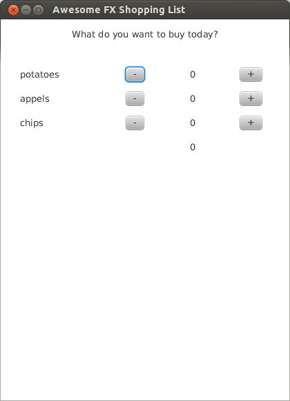
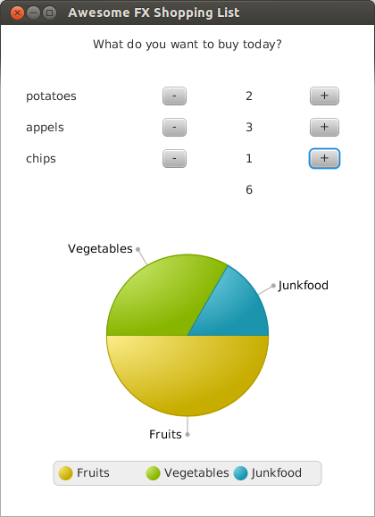
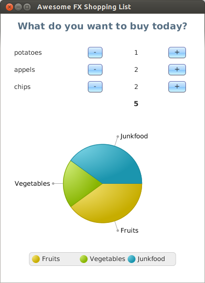

JavaFXWorkshop
==============

Meta: About the workshop
--------------------------
The workshop is an internal event for my coworkers. Target audience are developers who haven't heard much about JavaFX unit now but want to know what the hype is all about. I hope to get through with the content below in 4 hours. However, it's an open end workshop and we will discuss any special topic that comes up.

The code works with Java 7 and Java 8.

1. What is JavaFX and why should you care?
---------------
- successor of Swing
- Swing is dead! (Zombie-mode because for the time being it will be in the SDK)
- much more features like CSS-styling, rendering using graphic chip, binding, ...

2. Let's code!
--------------

Setup your tools:
- Eclipse IDE
- JDK >1.7u6 (with jfxrt.jar)
- SceneBuilder 1.1 (2.0 is still buggy) (http://www.oracle.com/technetwork/java/javafx/downloads/index.html)

**Part 1: SceneBuilder and .fxml-files**
- .fxml-file = user interface declaration
- Controller = Java class that controls one .fxml-file
- don't forget to set the controller in the SceneBuilder on your top component!
- fields and methods in your controller are bound to the .fxml with "@FXML"
- just a side note about the lifecycle of a JavaFX application (http://docs.oracle.com/javafx/2/api/javafx/application/Application.html)

>The entry point for JavaFX applications is the Application class. The JavaFX runtime does the following, in order, whenever an application is launched:
>
>    1. Constructs an instance of the specified Application class
>
>    2. Calls the init() method
>
>    3. Calls the start(javafx.stage.Stage) method
>
>    4. Waits for the application to finish, which happens when either of the following occur:
>
>    the application calls Platform.exit() OR the last window has been closed and the implicitExit attribute on Platform is true
>
>    5. Calls the stop() method

This is our first UI:

**Part 2: Properties and binding**
- Properties are a language extension - expect them to come around in the backend, too.
- extension of bean naming convention: 

    setMyFoo(...) {...}
    
    getMyFoo() {...}
    
    myFooProperty() {...}
    
- There is unidirectional and bidirectional binding: 

    myProperty.bind(...);
    
    myProperty.bindBidirectional(...);
    
- you can do math with properties, for example: sum.bind(amountOfApples.add(amountOfChips).add(amountOfPotatoes));
- you can listen on properties and get notified if there's a change
- great article about difference between ChangeListener and InvalidationListener: http://blog.netopyr.com/2012/02/08/when-to-use-a-changelistener-or-an-invalidationlistener/ (in short: InvalidationListener doesn't give you old and new value and fires even without the data changing. ChangeListener however is less performant. 

With properties, we can calculate the sum of the items in our list:

**Part 3: Charts - the pie chart**
- data behind chart = ObservableList. You can listen on that, too!
- because of that, you just have to change the data and the chart will be updated

A chart makes our shopping list much more interesting:

**Part 4: Styling with CSS**
- either directly for one component in SceneBuilder or in the code or in a CSS (you want to have the latter!)
- behold: not all CSS tags are available in JavaFX and you have to add a "-fx" before them: 

    -fx-background-color:red
    
- just in JavaFX - CSS: dropshadow

With styling, we now have a realy nice looking shopping list:

3. Swing Interop
----------------
- JavaFX in Swing easy. Swing in JavaFX not before JDK 8 (however possible)
- replace Swing components with FX components step by step
- maybe invert life cycle by setting a controller factory in FXML loader
- because of time constraints and focus of this workshop: Let's talk about that later and specific for your project. Also, there will be an article about that.

4. current state of JavaFX (Java 1.7 and Java 1.8)
-------------------------------------
- some basic components missing like date chooser
- some rough edges in the API
- huge hype with a lot of potential

- Ensemble (http://www.oracle.com/technetwork/java/javase/downloads/jdk7-downloads-1880260.html)
- controlsFX (http://fxexperience.com/controlsfx/)
- watch the first two minutes of http://www.youtube.com/watch?v=a3dAteWr40k&feature=youtu.be
- jfxtras (http://jfxtras.org/)

5. some more stuff to have a look at
-------------------------------------
- Oracle http://docs.oracle.com/javafx/
- More tools: Scenic View  (http://fxexperience.com/scenic-view/)
- More tools: e(fx)clipse (http://www.eclipse.org/efxclipse/index.html)
- 3D container terminal monitor (http://www.youtube.com/watch?v=AS26gZrYNy8)

Meta: Copyright
----------------
All files in this repository are under Creative Commons 4.0 (see http://creativecommons.org/licenses/by/4.0/). 

You are free to:

- Share — copy and redistribute the material in any medium or format
- Adapt — remix, transform, and build upon the material for any purpose, even commercially.

The licensor cannot revoke these freedoms as long as you follow the license terms.

Under the following terms:

- Attribution — You must give appropriate credit, provide a link to the license, and indicate if changes were made. You may do so in any reasonable manner, but not in any way that suggests the licensor endorses you or your use.
- No additional restrictions — You may not apply legal terms or technological measures that legally restrict others from doing anything the license permits.
